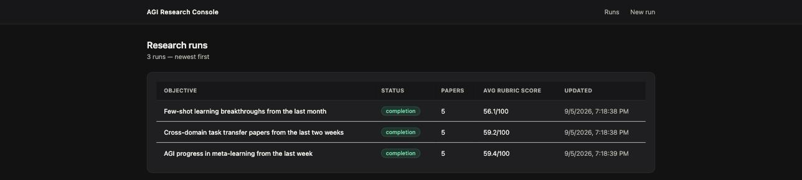
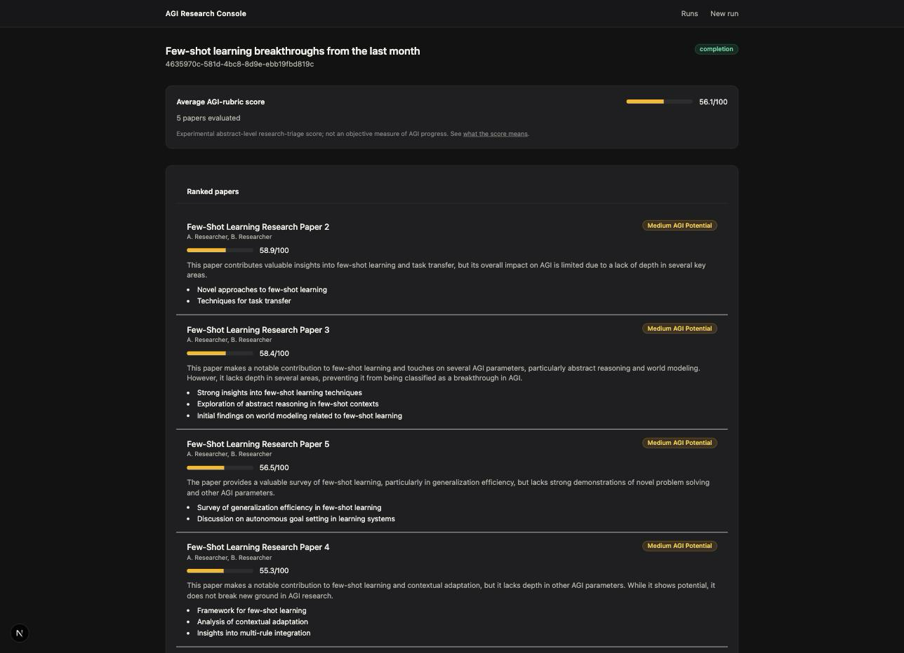

# Agentic Research Intelligence System

A LangGraph-based agentic research pipeline combining structured LLM
planning and paper evaluation with deterministic discovery, scoring, and
reporting:

```
LLM Planner  ->  deterministic Discovery  ->  LLM Evaluator  ->  deterministic scoring/reporting
```

An LLM planner turns a research objective into search keywords and a date
range, a deterministic discovery service finds and deduplicates arXiv
papers (no LLM — see [ADR 0002](docs/adr/0002-direct-tool-call-instead-of-react-agent.md)),
an LLM evaluator judges each paper against a ten-parameter rubric, and a
deterministic scorer/reporter turns those judgments into a weighted 0-100
score and a report. Two of the four stages are plain, testable Python;
only planning and evaluation touch an LLM at all — see
[**what the score means**](#what-the-score-means) before treating the
result as more than that.

It's built as a service: the LangGraph pipeline behind a FastAPI API,
persisted to Postgres/SQLite, with a Next.js dashboard on top.

<p align="center">
  <br>
  <sub>Run queue — status, paper count, and average rubric score at a glance.</sub>
</p>

<p align="center">
  <br>
  <sub>Run detail — the score-meaning disclaimer, and every paper ranked with its classification and key innovations.</sub>
</p>

## Why it's built this way

The short version — the full reasoning for each decision is in
[`docs/adr/`](docs/adr/):

- **[Structured outputs, not regex-parsed prose.](docs/adr/0001-structured-agent-outputs.md)**
  Every agent's response is a validated Pydantic model. Along the way, a
  real schema constraint surfaced and got fixed: OpenAI's strict
  structured-output mode rejects an open-ended `dict[str, Model]` field
  outright, so per-parameter scores became ten explicit named fields.
- **[A direct tool call for discovery, not a ReAct agent.](docs/adr/0002-direct-tool-call-instead-of-react-agent.md)**
  By the time discovery runs, the plan has already fully determined the
  search arguments — wrapping that in an LLM tool-calling loop adds failure
  modes (skipped calls, wrong arguments, duplicate calls) with no
  corresponding benefit.
- **[The LLM provider is a config value, not a code path.](docs/adr/0003-provider-agnostic-llm-layer.md)**
  `LLM_PROVIDER=fake` and `ARXIV_PROVIDER=fake` (both defaults) run the
  entire real pipeline against deterministic offline stand-ins. No API key
  or network access is required to run this project or its test suite.
- **[Deduplication and validation are pure functions.](docs/adr/0004-deterministic-discovery-pipeline.md)**
  Deciding whether two titles are the same paper doesn't need a model — a
  normalized-title match and an abstract-length floor are deterministic,
  explainable, and unit-tested with zero network dependency.
- **[Persistence and auth, sized to what this domain actually has.](docs/adr/0005-persistence-and-auth.md)**
  One table, one bearer-token role — no fabricated audit log or reviewer
  role copied from a domain that actually needs them.
- **[The judge is evaluated, not just the pipeline.](docs/adr/0006-agi-judge-evaluation.md)**
  Golden-case classification, calibration against hype-vs-substance probes,
  and repeat-call self-consistency — run for real against `gpt-4o-mini`,
  not asserted. The honest results, including the methodology's own limits,
  are in the ADR.
- **[One paper's evaluation failing can't take down the whole run.](docs/adr/0007-fault-tolerant-evaluation-and-progress-streaming.md)**
  Each paper gets up to 3 isolated retry attempts, with exponential
  backoff and jitter between them — but only for failures worth retrying
  (a malformed structured-output response, a connection/timeout/rate-limit
  error); a plain bug in this code fails fast on the first attempt instead
  of burning all three. A paper that still fails is recorded (id, title,
  error, attempt count) and skipped, not fatal to the other nine. Papers
  evaluate through a bounded thread pool
  (`EVALUATION_CONCURRENCY`, default 4) — a measured 1.9x speedup on a
  5-paper run, never an unbounded burst of concurrent LLM calls. The same
  ADR fixes a second bug — the API and the graph could each mint a
  `request_id`, reconciled after the fact by a `model_copy` workaround —
  down to one id, generated once, and adds a streaming interface so the
  dashboard's polling shows real phase progress instead of only the final
  outcome.

## Architecture

```
                    ┌─────────────────────────────┐
                    │      Next.js dashboard       │
                    │  (Server Components +        │
                    │   Server Actions; token       │
                    │   never reaches the browser)  │
                    └───────────────┬───────────────┘
                                    │ REST (bearer auth)
                    ┌───────────────▼───────────────┐
                    │           FastAPI              │
                    │  research router · auth ·      │
                    │  rate limiting · SQLAlchemy     │
                    │  (ResearchRunRecord, persisted  │
                    │   after every graph step)       │
                    └───────────────┬───────────────┘
                                    │ BackgroundTasks (see limits below)
                                    │ + stream_research() snapshots
                    ┌───────────────▼───────────────┐
                    │        LangGraph pipeline      │
                    │                                │
                    │   supervisor (phase machine)   │
                    │        │      │      │         │
                    │     planner discovery evaluation│ ← planner/discovery
                    │      (LLM)   (service) (LLM,    │   sequential;
                    │        │      │      per-paper, │   evaluation runs
                    │        │      │  bounded pool + │   up to N papers
                    │        │      │  retry+isolate) │   concurrently
                    │        └──────┴──────┘         │
                    │            supervisor          │
                    └───────────────┬───────────────┘
                                    │
                     ┌──────────────┼──────────────┐
                     ▼              ▼              ▼
              domain/scoring   services/discovery  reports.py
              (deterministic)  (deterministic)     (deterministic)
```

## Repository layout

```
backend/            Python: domain logic, agents, graph, arXiv service, FastAPI service
  src/agiresearch/
    domain/          Pure business logic: AGI scoring, typed schemas
    llm/             Provider-agnostic client + offline fake model
    tools/           arXiv search/dedup/validate + offline fake stand-in
    agents/          planner.py, evaluator.py — the two stages that call an LLM
    services/        discovery.py — deterministic, not an agent (see ADR 0002)
    graph/           The LangGraph pipeline definition
    api/             FastAPI app: routers, auth, persistence, rate limiting
    evals/           Golden-case classification + judge reliability/calibration evals
    reports.py       Markdown report rendering (pure)
  data/              Golden paper fixtures, judge-reliability calibration cases
  tests/             pytest: unit (domain/tools) + integration (graph, API, evals)
apps/web/            Next.js 15 dashboard (run queue, new-run form, run detail)
infra/               Dockerfiles + docker-compose (api, web, Postgres)
docs/adr/            Architecture decision records
```

## Running it

### Locally (fastest inner loop)

```bash
# Backend
cd backend
uv sync --extra dev
uv run uvicorn agiresearch.api.main:app --reload --port 8000

# Frontend, in another terminal
cd apps/web
npm install
cp .env.local.example .env.local
npm run dev
```

Open `http://localhost:3000`, go to **New run**, describe an objective, and
submit — no API key needed, `LLM_PROVIDER=fake` / `ARXIV_PROVIDER=fake` are
the defaults. Swap in a real LLM by copying `backend/.env.example` to
`backend/.env` and setting `LLM_PROVIDER=openai` + `OPENAI_API_KEY` (arXiv
discovery needs no key — `ARXIV_PROVIDER=live` just needs network access).

### Docker Compose (Postgres-backed)

```bash
docker compose -f infra/docker-compose.yml up --build
```

Dashboard at `http://localhost:3000`, API at `http://localhost:8000`.

## Testing and evals

```bash
cd backend
uv run pytest tests -q                              # unit + integration tests, all offline
uv run python -m agiresearch.evals.run               # golden-case classification eval
uv run python -m agiresearch.evals.judge_reliability # calibration + self-consistency eval
uv run ruff check src tests                          # lint
```

`tests/integration/test_graph_fake_llm.py` runs the real LangGraph pipeline
end to end — real phase machine, real dedup/validation, real weighted-score
arithmetic — against the offline fake LLM and fake arXiv stand-in, so it
needs no API key and no network access.

`evals/run.py` and `evals/judge_reliability.py` are both explained in full
in [ADR 0006](docs/adr/0006-agi-judge-evaluation.md), which names the
exact dated snapshot file under `backend/eval-results/` each number below
came from — a real-model eval result is a point-in-time snapshot (tagged
with the provider, model, prompt hash, and rubric version that produced
it), not a permanent property of this system, and the ADR is the place to
check for whatever the latest snapshot says rather than trusting a number
quoted here to still be current. As of the snapshots referenced there: 3/3
golden papers landed in the right score band, and 8/10 calibration probes
(one per named failure mode — hype language, benchmark-only results,
cross-domain transfer, pure scaling, weak evidence for a strong claim,
...) did too, reproduced across two independent runs. The two misses are
reported as found, not tuned away: the judge measurably under-penalizes
strong claims backed by weak evidence — a real calibration gap, and
exactly the kind of finding this eval exists to surface. Both scripts also
run fully offline as CI smoke tests — not a quality gate in that mode,
and never writing to `eval-results/`, since the fake judge is a keyword
heuristic, not a real judgment.

## What the score means

The 0-100 score is an **experimental research-triage heuristic** based on
an explicitly defined ten-parameter rubric (`domain/scoring.py`). It is
intended to help prioritize papers for further human review — it is not,
and is not presented as, an objective scientific measurement of AGI
progress. Concretely:

- Evaluation is based **primarily on paper abstracts and titles**, not full
  papers — a real methodology section, ablation study, or reproduction
  attempt could change a paper's actual merit in ways an abstract doesn't
  reveal.
- The LLM produces **qualitative parameter judgments** (a 1-10 score per
  parameter, with reasoning) — this is a subjective, model-dependent
  judgment call, not a measurement with an error bar.
- The **weighted-score arithmetic itself is deterministic** (`domain/scoring.py`,
  no LLM involved) — the score's uncertainty comes entirely from the
  judgments feeding into it, not from the arithmetic.
- Results are **prioritization signals**, ranking papers relative to each
  other for this pipeline's own rubric — not authoritative conclusions
  about which papers matter for AGI research.

See [ADR 0006](docs/adr/0006-agi-judge-evaluation.md) for how the judge
producing these scores is itself calibrated and evaluated, and what that
evaluation did and didn't find.

## Security posture (and its limits)

- Auth is a single bearer token; the frontend keeps it server-side and
  never ships it to the browser.
- A simple in-process rate limiter sits in front of the API — every
  research run can trigger several LLM calls, so an unmetered endpoint is
  a real cost and abuse vector even without a privileged second role to
  protect against.
- What's explicitly **not** production-hardened, and documented as such in
  [ADR 0005](docs/adr/0005-persistence-and-auth.md): the auth token is a
  placeholder for a real identity provider, there's no encryption-at-rest,
  and the rate limiter doesn't survive multiple instances.
- Research runs currently execute through FastAPI `BackgroundTasks`. This
  is intentionally sufficient for the current deployment model, but
  execution is process-local and not durable: job execution is tied to the
  API process, an API process crash or restart can lose an in-progress
  run, and there is currently no persistent job queue. A deployment
  requiring guaranteed execution across process restarts would move jobs
  to a persistent queue/worker architecture instead — not needed for this
  version, see [ADR 0005](docs/adr/0005-persistence-and-auth.md).
